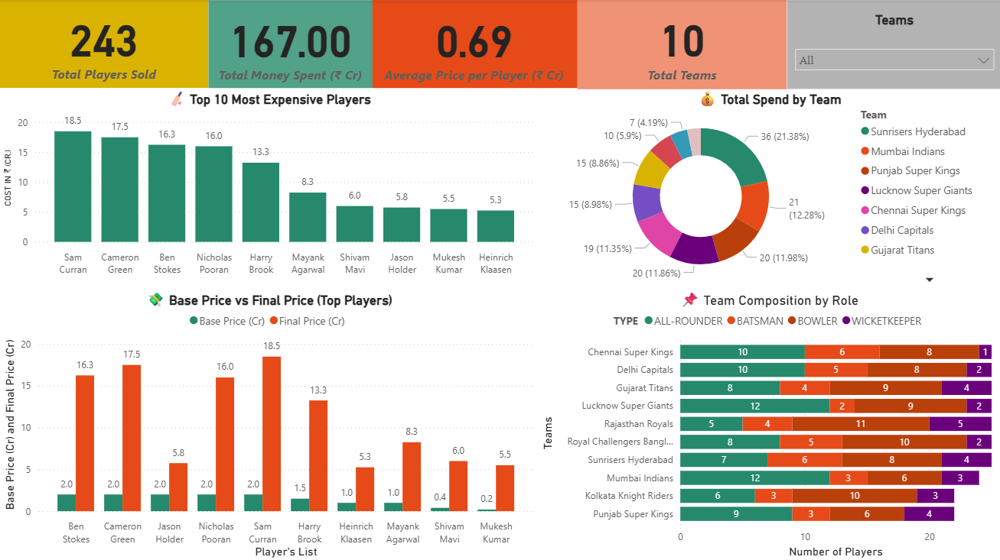
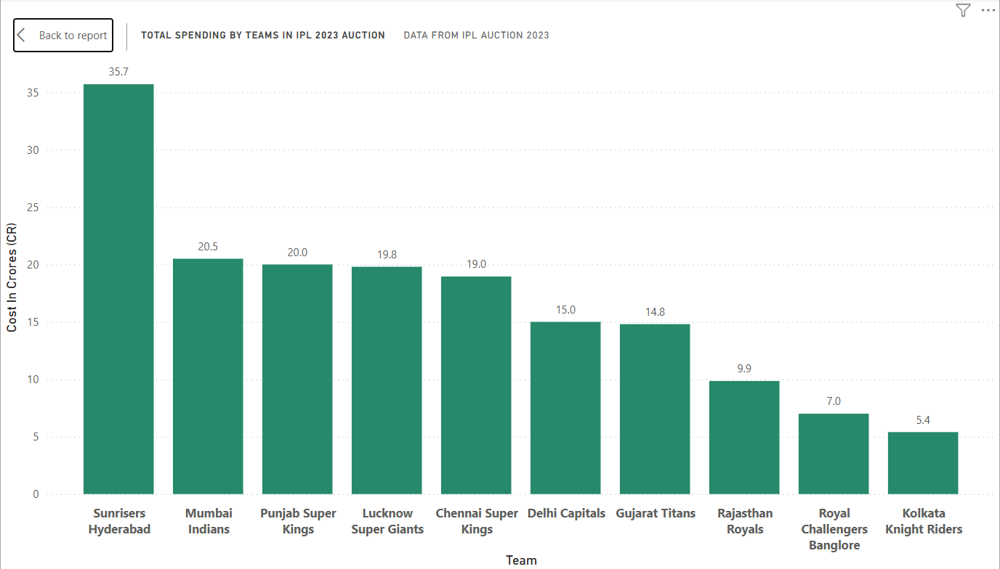
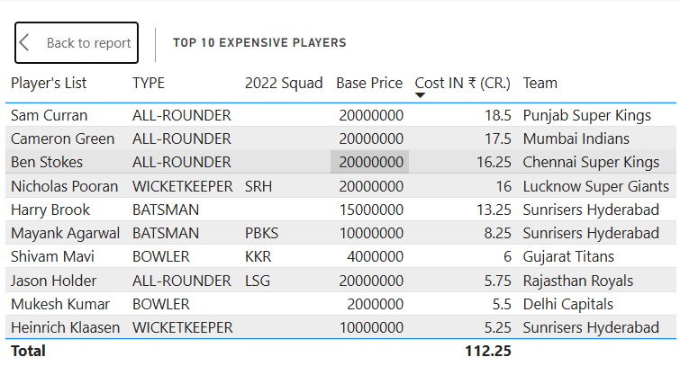

# 🏏 IPL 2023 Auction Dashboard — Power BI Project

## 📘 Project Overview
This project analyzes the **IPL 2023 Auction dataset** using **Power BI** to uncover insights about player costs, team composition, and overall spending trends.  
The dashboard provides an interactive and visual understanding of how teams invested in players, comparing base and final prices, and identifying the most expensive buys.

---

## 🎯 Objective
To create a **data-driven dashboard** that highlights:
- 💰 Top 10 most expensive players  
- 🧑‍🤝‍🧑 Team composition by player role  
- ⚖️ Base Price vs Final Price analysis  
- 🏆 Total spending across all franchises  
- 📊 Key insights on player distribution and value  

---

## 🛠️ Tools & Technologies
- **Power BI** – for dashboard creation and visualizations  
- **Power Query** – for data transformation and cleaning  
- **DAX (Data Analysis Expressions)** – for calculated measures and KPIs  
- **Excel / CSV** – for dataset storage  

---

## 🧹 Data Preparation
The raw dataset was cleaned and transformed in **Power Query**:
- Removed “Unsold” entries for accurate team analysis  
- Standardized player roles and team names  
- Converted prices from rupees to crores for better readability  

---

## 📊 Dashboard Features
### 1️⃣ Top 10 Expensive Players
Displays the highest-paid players based on final auction price.  

### 2️⃣ Team Composition by Role
Pie or bar chart visualizing the distribution of player roles (Batsmen, Bowlers, All-rounders, Wicket Keepers) per team.  

### 3️⃣ Base Price vs Final Price
Clustered column chart comparing how much players were bought for relative to their base price.  

### 4️⃣ KPIs
- Total Players Sold  
- Total Teams (10)  
- Total Base Price (Cr)  
- Total Final Cost (Cr)  

---

## 📈 Key Insights
- **Top buys** highlight teams focusing on marquee players.  
- **Spending variation** shows strategic investments across franchises.  
- **Base vs Final Price** comparison reveals market value fluctuations.  
- **Team composition** indicates player mix and auction strategy.  

---

## 🧠 Skills Demonstrated
- Data Cleaning & Transformation  
- Power Query (ETL)  
- DAX Calculations  
- Interactive Visualization  
- Data Storytelling & Dashboard Design  

---

## 📂 Project Structure
```
📁 IPL-2023-Auction-Dashboard
 ┣ 📊 IPL_Squad_2023_Auction_Dataset.csv
 ┣ 📘 IPL_Auction_Dashboard.pbix
 ┣ 🖼️ dashboard_preview.png
 ┗ 📝 README.md
```


## 🖼️ Screenshots

### Dashboard Overview


### Team-wise Expenditure


### Top Expensive Players


---

## 🚀 How to Use
1. Clone this repository:
   ```bash
   git clone https://github.com/<your-username>/ipl-auction-powerbi.git

---

## 🙌 Acknowledgment
Dataset sourced from publicly available IPL 2023 auction data.  
Built as a learning project to strengthen **Power BI** and **data analytics** skills.
